# Finance Data Processing and Access Control Backend

This is a FastAPI backend for a finance dashboard system. I built it around a simple SQLite database, JWT based login, role based access control, and a small service layer so the code stays easy to follow.

The project covers:
- user creation, login, and active or inactive user state
- financial record create, read, update, delete
- record filtering by type, category, and date
- dashboard summary data for a frontend
- audit logging for important actions
- route level RBAC for viewer, analyst, and admin

## Architecture



## Roles

The system uses three roles:

- `viewer`: can read dashboard summary and records
- `analyst`: can read dashboard summary and records
- `admin`: can manage users, manage records, and read audit logs

## Access Rules

| Action | Viewer | Analyst | Admin |
| --- | --- | --- | --- |
| Login | ✅ | ✅ | ✅ |
| View records | ✅ | ✅ | ✅ |
| Filter records | ✅ | ✅ | ✅ |
| View dashboard summary | ✅ | ✅ | ✅ |
| Create record | ❌ | ❌ | ✅ |
| Update record | ❌ | ❌ | ✅ |
| Delete record | ❌ | ❌ | ✅ |
| Create user | ❌ | ❌ | ✅ |
| Update user | ❌ | ❌ | ✅ |
| View audit logs | ❌ | ❌ | ✅ |

## Tech Stack

- FastAPI
- Pydantic
- SQLite
- PyJWT
- Passlib
- Pytest

## Project Structure

```text
zorvyn/
├── docs/
│   └── finance_db_architecture.svg
├── src/
│   ├── api/
│   │   ├── audit.py
│   │   ├── dashboard.py
│   │   ├── records.py
│   │   └── users.py
│   ├── core/
│   │   ├── exceptions.py
│   │   └── security.py
│   ├── db/
│   │   ├── db.py
│   │   ├── migration.py
│   │   └── seed.py
│   ├── models/
│   │   ├── audit.py
│   │   ├── common.py
│   │   ├── dashboard.py
│   │   ├── error.py
│   │   ├── transaction.py
│   │   └── user.py
│   ├── services/
│   │   ├── audit_service.py
│   │   ├── dashboard_Services.py
│   │   ├── finance_Services.py
│   │   └── user_services.py
│   └── main.py
├── tests/
└── README.md
```

## Data Model

### Users

- `id`
- `name`
- `email`
- `password`
- `role`
- `is_active`
- `created_at`

### Records

- `id`
- `user_id`
- `amount`
- `type`
- `category`
- `date`
- `notes`
- `created_at`

### Audit Logs

- `id`
- `user_id`
- `action`
- `target_id`
- `details`
- `created_at`

## API Summary

### Auth and Users

- `POST /users/login`
- `POST /users`
- `PATCH /users/{user_id}`

### Records

- `GET /records`
- `POST /users/{user_id}/records`
- `PATCH /records/{record_id}`
- `DELETE /records/{record_id}`

### Dashboard

- `GET /dashboard/summary`

### Audit Logs

- `GET /audit-logs`

## Request Notes

### Login

`POST /users/login`

```json
{
  "email": "admin@zorvyn.dev",
  "password": "admin123"
}
```

Response:

```json
{
  "access_token": "jwt-token",
  "token_type": "bearer"
}
```

### Create User

`POST /users`

Requires admin token.

```json
{
  "name": "Faraz",
  "email": "faraz@example.com",
  "password": "secret123",
  "role": "admin",
  "is_active": true
}
```

### Create Record

`POST /users/{user_id}/records`

Requires admin token.

```json
{
  "amount": 125.5,
  "type": "credit",
  "category": "salary",
  "date": "2026-04-04",
  "notes": "monthly pay"
}
```

### Filter Records

`GET /records?type=credit&category=salary&date=2026-04-04`

Requires viewer, analyst, or admin token.

### Dashboard Summary

`GET /dashboard/summary`

Current response includes:

- total income
- total expense
- net balance
- category breakdown
- recent activity
- monthly trends

## Running The Project

Install dependencies first, then run:

```bash
uvicorn src.main:app --reload
```

Docs:

- [http://127.0.0.1:8000/docs](http://127.0.0.1:8000/docs)
- [http://127.0.0.1:8000/redoc](http://127.0.0.1:8000/redoc)

## Seed Data

I added a small seed script so the project is easy to demo locally.

Run:

```bash
python3 -m src.db.seed
```

It creates:

- 3 sample users
- 4 sample records
- 3 sample audit log entries

Seed users:

- `admin@zorvyn.dev / admin123`
- `analyst@zorvyn.dev / analyst123`
- `viewer@zorvyn.dev / viewer123`

## Tests

Run:

```bash
pytest -q
```

Current status in this repo:

```text
44 passed
```

## Validation and Error Handling

I kept validation close to the models and service layer.

- Pydantic handles request validation
- custom exceptions return consistent JSON errors
- auth errors return `401`
- permission errors return `403`
- missing data returns `404`
- bad input or invalid operations return `400`

## Tradeoffs

### Why I used SQLite

I used SQLite to keep setup simple and make the project easy to run for review. The tradeoff is that it is a good fit for a demo or assessment project, but not the database I would pick for a larger multi-user production system.

### Why I used a service layer

I put most logic in `services` so the route files stay small and easier to read. The tradeoff is a few extra files, but I think it makes the project easier to maintain.

### Why I used JWT with route level role checks

I used JWT so the API can identify the user on each request without keeping server side session state. I also used route dependencies for role checks because it keeps the permission rules visible in the endpoint definitions. The tradeoff is that role changes only apply to new tokens after the next login.

### Why audit logs are internal only

I removed the public create audit log API and only create audit logs from the service layer when important actions happen. I did this so clients cannot fake audit events. The tradeoff is less flexibility, but it keeps the audit trail more trustworthy.

### Why I added `is_active`

I added `is_active` because the assignment asked for active and inactive users, and it gives a simple way to block login without deleting accounts. The tradeoff is that there is still no separate user lifecycle flow yet, just a boolean flag managed by admin.

### Why password hashing uses Passlib with `pbkdf2_sha256`

I added password hashing so passwords are not stored in plain text. In this environment I used `pbkdf2_sha256` because the installed `bcrypt` backend was not working correctly. The tradeoff is that it differs from the original bcrypt plan, but it still gives proper password hashing and keeps the project working cleanly.

## What Is Still Simple On Purpose

This project is meant for assessment, so I kept some things intentionally small:

- no refresh token flow
- no password reset flow
- no pagination yet
- no soft delete flow
- no separate admin UI

The focus here is clean backend structure, correct role checks, and clear business logic.
